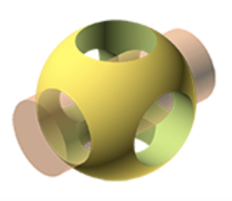

# Exercise in OpenSCAD

Learning 3D modeling with [OpenSCAD](https://openscad.org/) from the great exercise book by Sachidanand Jha.

You can find the book here: [OpenSCAD Exercise](https://www.amazon.ca/dp/1072163020?psc=1&smid=A3DWYIK6Y9EEQB&ref_=chk_typ_imgToDp).

I'll try to put my learning, analyzing as well as the codes into each exercise, and looking forward to seek comments from all of you!

Love the [article](https://springtree.nl/posts/programming-in-3d), in which Mark Doeswilk says "programming is a skill, the language is merely a choice", really true!

Enjoy!!!