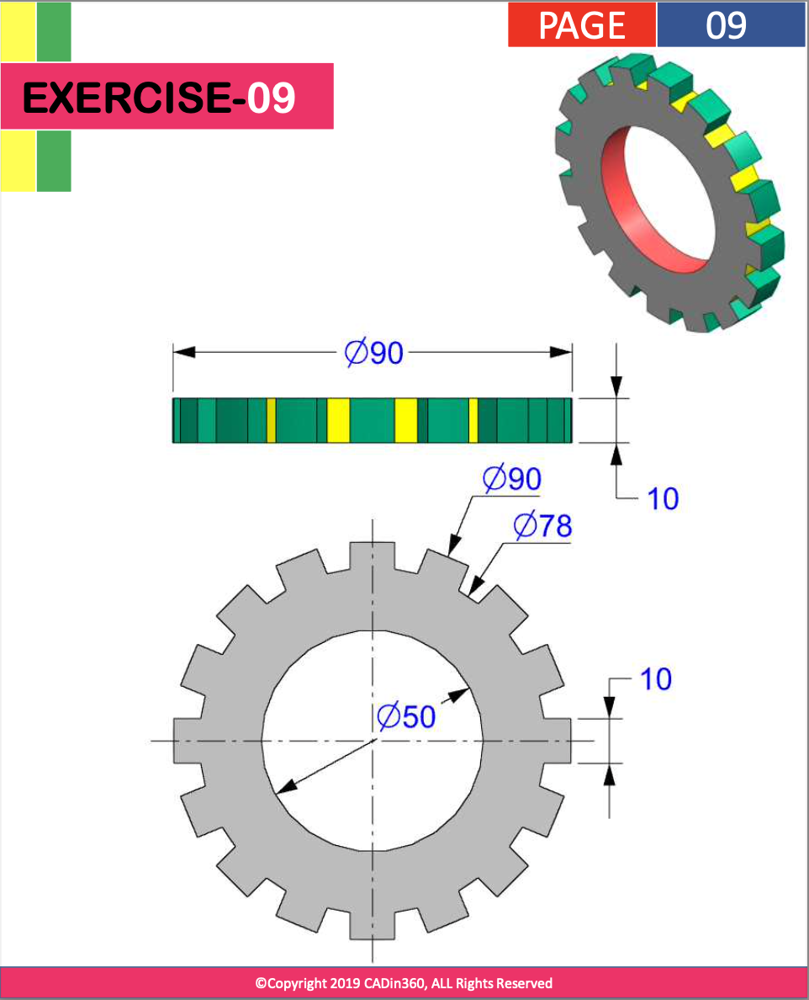

# Exercise 009 using OpenSCAD

## Source Question



Analysis:

- It is quite important to have way of drawing Gear
- This code for now is just one quick workaround, I draw `cube` and let it trim by outer circle
- [ ] need to get mathematical way to calculate.

## Code

```openscad
$fn = 50;
linear_extrude(10) {
    difference() {
        intersection() {
            circle(90/2);
            union() {
                circle(78/2);
                for (i = [0 : 360/16 : 360/16*15]) {
                    rotate(i)
                    translate([0,-5])
                        square([50, 10]);
                }
            }
        }
        circle(50/2);
    }
}
```

## View in OpenSCAD


Date: 2022/12/03

Author: Xiaoqi Zhao