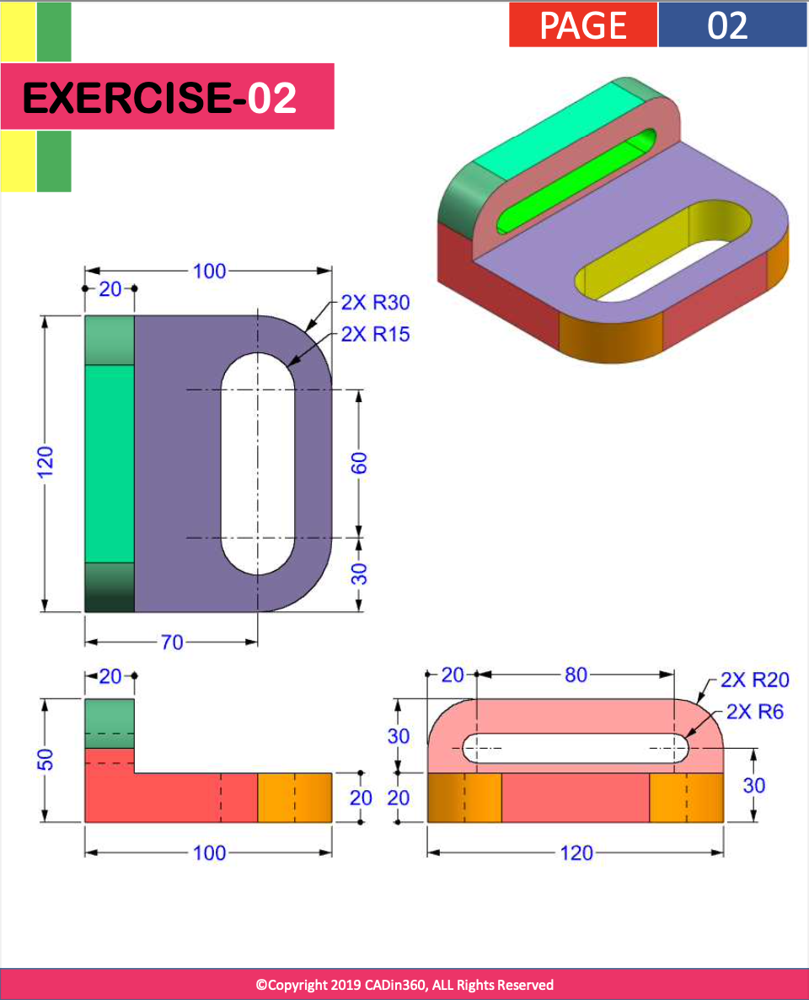
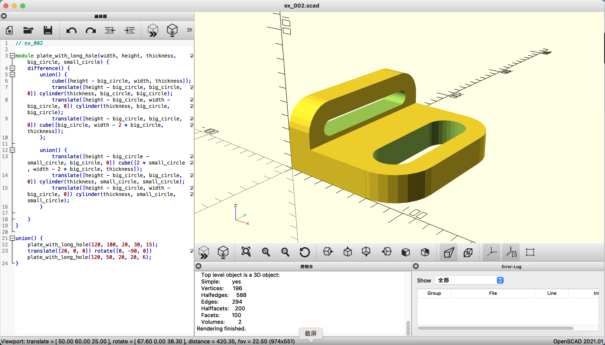

# Exercise 002 using OpenSCAD

## Source Question



Analysis:

- Although the horizontal and virtual parts are in different dimension, but the structure are in same pattern, which is just one plate with a long hole (the long hole composite with one rectangle and two half-circle/cylinder)
- Still good to draw 2D shape and extrude into 3D
- Practice using module to receive different parameters into same function -- reusability is key!

## Code

```openscad
module plate_with_long_hole(width, height, thickness, big_circle, small_circle) {
    difference() {
        union() {
            cube([height - big_circle, width, thickness]);
            translate([height - big_circle, big_circle, 0]) cylinder(thickness, big_circle, big_circle);
            translate([height - big_circle, width - big_circle, 0]) cylinder(thickness, big_circle, big_circle);
            translate([height - big_circle, big_circle, 0]) cube([big_circle, width - 2 * big_circle, thickness]);
        };
        
        union() {
            translate([height - big_circle - small_circle, big_circle, 0]) cube([2 * small_circle, width - 2 * big_circle, thickness]);
            translate([height - big_circle, big_circle, 0]) cylinder(thickness, small_circle, small_circle);
            translate([height - big_circle, width - big_circle, 0]) cylinder(thickness, small_circle, small_circle);
        }
     
    }
}

union() {
    plate_with_long_hole(120, 100, 20, 30, 15);
    translate([20, 0, 0]) rotate([0, -90, 0]) plate_with_long_hole(120, 50, 20, 20, 6);
}
```

## View in OpenSCAD



Date: 2022/12/03

Author: Xiaoqi Zhao