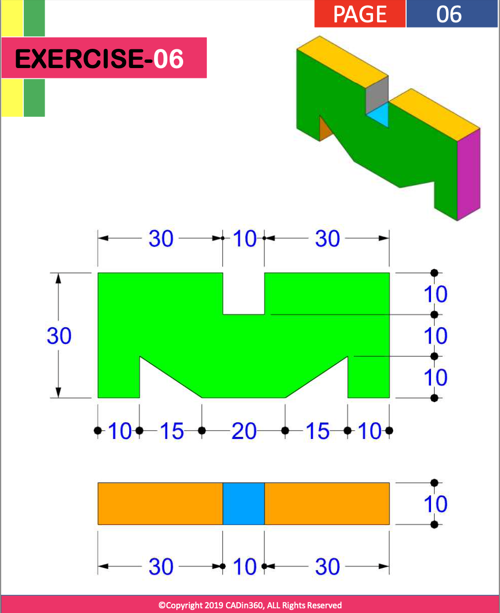

# Exercise 006 using OpenSCAD

## Source Question



Analysis:

- This one is simple, so just use `difference()` to remove certain parts
- Interesting to try alternative way, draw half and add its mirror
- The right one is using `method1()`, the left one is using `method2()`

## Code

```openscad
// Draw directly
module method1() {
    difference() {
        square([30,70]);
        translate([20,30]) square([10,10]);
        polygon([[0,10],[10,10],[0,25]]);
        polygon([[0,45],[10,60],[0,60]]);
    }
}

// Use mirror()
module method2() {
    translate([0,-35])
    difference() {
        square([30,35]);
        translate([20,30]) square([10,5]);
        polygon([[0,10],[10,10],[0,25]]);
    }
}

translate([85, 0, 0]) rotate([0, -90, 90]) linear_extrude(10) method1();


translate([-50, 0, 0])
rotate([0, -90, 90]) {
    linear_extrude(10) method2();
    linear_extrude(10) mirror([0,-35]) method2();
}
```

## View in OpenSCAD


Date: 2022/12/03

Author: Xiaoqi Zhao