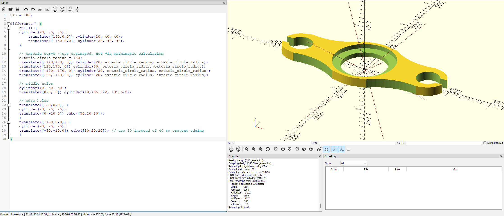

# Exercise 007 using OpenSCAD

## Source Question


Analysis:

- Practice `hull()` to join shapes, however it's only join in straight line
- Mathematically, the "Inscribed line" should be considered from the "large" exteria circle (not provide the radius value in the chart), just give manually estimate using the center `[120,170]` with `radius = 130` to draw one cylinder and be trimmed from the hulled shape. 
  - [ ] here need further investigation on making those inscribed lines in real mathimatically correct.
- Other holes are easy parts after previous exercise. 

## Code

```openscad
$fn = 100;

difference() {
    hull() {
    cylinder(20, 75, 75);
        translate([150,0,0]) cylinder(20, 40, 40);
        translate([-150,0,0]) cylinder(20, 40, 40);
    }
    
    // exteria curve (just estimated, not via mathimatic calculation
    exteria_circle_radius = 130;
    translate([-120,170, 0]) cylinder(20, exteria_circle_radius, exteria_circle_radius);
    translate([120,170, 0]) cylinder(20, exteria_circle_radius, exteria_circle_radius);
    translate([-120,-170, 0]) cylinder(20, exteria_circle_radius, exteria_circle_radius);
    translate([120,-170, 0]) cylinder(20, exteria_circle_radius, exteria_circle_radius);
    
    // middle holes
    cylinder(10, 50, 50);
    translate([0,0,10]) cylinder(10,135.6/2, 135.6/2);
    
    // edge holes
    translate([150,0,0]) {
    cylinder(20, 25, 25);
    translate([0,-10,0]) cube([50,20,20]);
    }
    translate([-150,0,0]) {
    cylinder(20, 25, 25);
    translate([-50,-10,0]) cube([50,20,20]); // use 50 instead of 40 to prevent edging
    }
}
```

## View in OpenSCAD



Date: 2022/12/03

Author: Xiaoqi Zhao