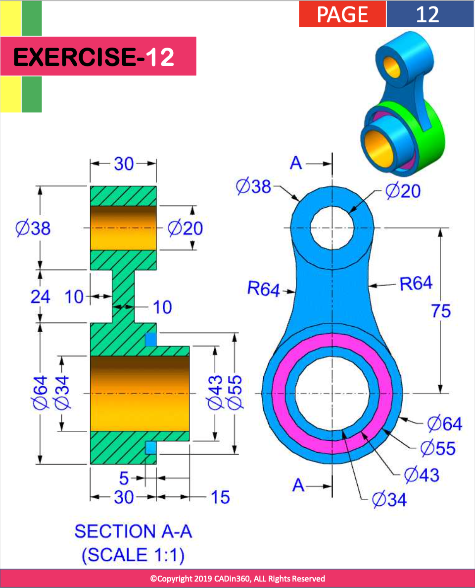
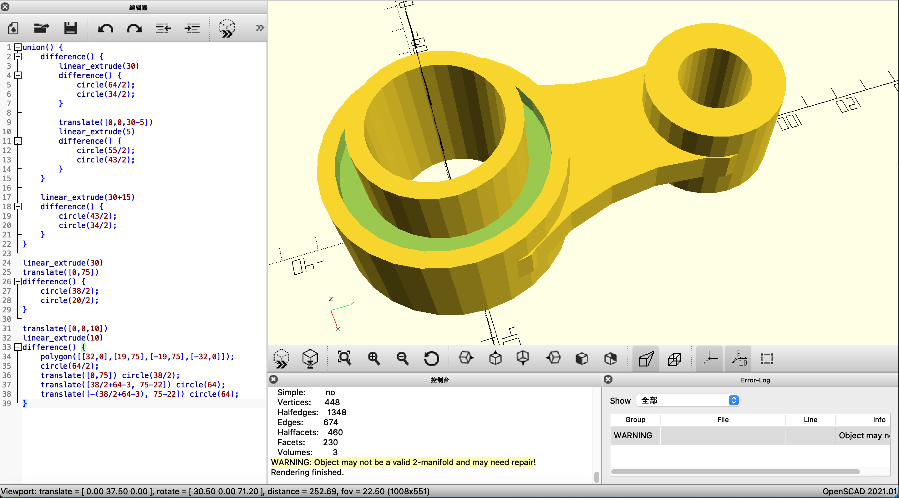

# Exercise 012 using OpenSCAD

## Source Question



Analysis:

- Try draw `polygon()` instead of `hull()`

## Code

```openscad
union() {
    difference() {
        linear_extrude(30)
        difference() {
            circle(64/2);
            circle(34/2);
        }

        translate([0,0,30-5])
        linear_extrude(5)
        difference() {
            circle(55/2);
            circle(43/2);
        }
    }

    linear_extrude(30+15)
    difference() {
        circle(43/2);
        circle(34/2);
    }
}

linear_extrude(30)
translate([0,75])
difference() {
    circle(38/2);
    circle(20/2);
}

translate([0,0,10])
linear_extrude(10)
difference() {
    polygon([[32,0],[19,75],[-19,75],[-32,0]]);
    circle(64/2);
    translate([0,75]) circle(38/2);
    translate([38/2+64-3, 75-22]) circle(64);
    translate([-(38/2+64-3), 75-22]) circle(64);
}
```

## View in OpenSCAD



Date: 2022/12/03

Author: Xiaoqi Zhao