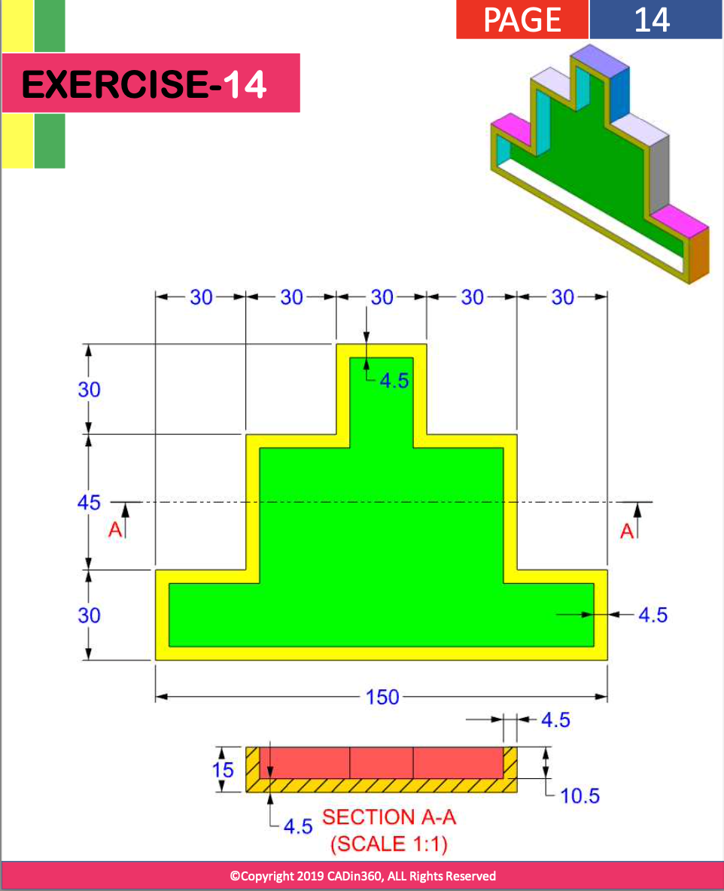

# Exercise 014 using OpenSCAD

## Source Question



Analysis:

- Use `offset` in 2D drawing

## Code

```openscad
color("green")
linear_extrude(15-10.5)
    union() {
        square([150,30]);
        translate([30,30]) square([90,45]);
        translate([30+30,30+45]) square([30,30]);
    }

color("cyan")
linear_extrude(15)
    difference() {
        union() {
            square([150,30]);
            translate([30,30]) square([90,45]);
            translate([30+30,30+45]) square([30,30]);
        }
        
        offset(-4.5) {
            union() {
                square([150,30]);
                translate([30,30]) square([90,45]);
                translate([30+30,30+45]) square([30,30]);
            }
        }
    }
```

## View in OpenSCAD


Date: 2022/12/03

Author: Xiaoqi Zhao